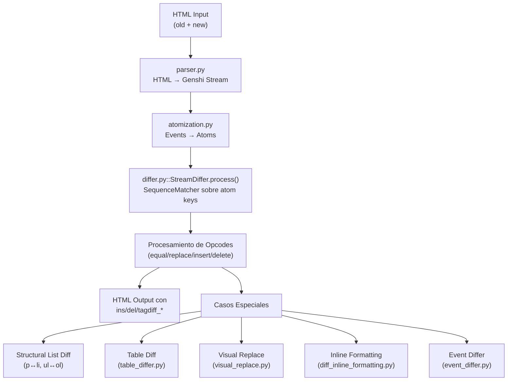
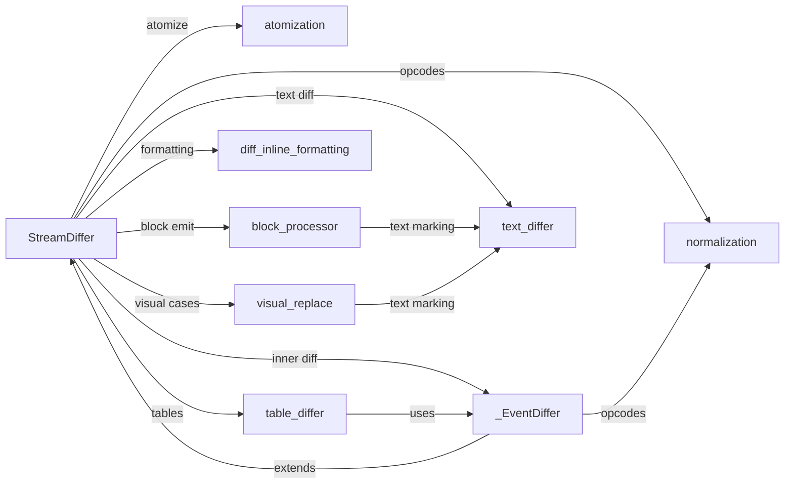

# Análisis Completo: htmldiff2 (Fork EdenAI)

## Visión General

Este módulo es un fork de `htmldiff2` especializado para el servicio **EdenAI Report**. Compara un *draft* HTML inicial contra un *reporte sugerido* por un LLM y produce un HTML de salida con marcadores `<ins>`, `<del>` y clases CSS especiales que permiten al frontend mostrar cambios granulares y ejecutar acciones por cambio (Apply/Reject).

---

## Arquitectura del Pipeline

El procesamiento sigue un pipeline de **5 fases**:



---

## Módulos y Responsabilidades

### 1. [config.py] — Configuración
Clase `DiffConfig` con ~25 parámetros que controlan todo el comportamiento:
- **`delete_first`**: Ordena siempre `<del>` antes de `<ins>` (requerimiento de producto)
- **`add_diff_ids` / `diff_id_attr`**: Genera `data-diff-id` en cada marcador para que el frontend pueda Apply/Reject por cambio individual
- **`bulk_replace_similarity_threshold`** (0.3): Si `SequenceMatcher.ratio() < 0.3`, renderiza como bloque delete+insert completo en vez de diff granular
- **`track_attrs`**: Atributos cuyo cambio debe generar diff visible (style, class, src, href, ref, data-ref)
- **`visual_container_tags`**: Tags donde cambios solo de atributos/tag deben producir diff visible
- **`enable_list_atomization` / `enable_table_atomization`**: Toggles para atomización estructural
- **`force_event_diff_on_equal_for_tags`**: Tags como `` que deben diffarse aún cuando el atom key es "equal"
- **`sequence_match_threshold`**: Umbral mínimo de tokens para `InsensitiveSequenceMatcher` (evita "shredding")

Constantes clave:
- `INLINE_FORMATTING_TAGS` = `{span, strong, b, em, i, u}`
- `BLOCK_WRAPPER_TAGS` = `{p, h1-h6}`
- `STRUCTURAL_TAGS` = `{p, br, table, ul, ol, li, tr, td, th, h1-h6}`

---

### 2. [parser.py] — Parsing HTML
- `parse_html()`: Usa **html5lib** + **genshi** para convertir HTML → stream de eventos `(START, END, TEXT)`
- Envuelve en `<div class="diff">` como wrapper artificial
- `longzip()`: Utility para iterar dos secuencias de longitudes diferentes, yieldeando `None` para los faltantes

---

### 3. [atomization.py] — Atomización de Eventos
**Fase crítica**: Transforma la lista plana de eventos Genshi en "átomos" con keys comparables.

#### Tipos de átomo:
| Tipo | Key | Descripción |
|------|-----|-------------|
| `block` | `(tag, text, ...)` | Bloque estructural (`<li>`, `<tr>`, `<td>`, `<p>`, `<h1-6>`, `<table>`) |
| `text` | `('t', token)` | Token de texto individual (split por regex) |
| `event` | `('e', type, data)` | Evento suelto (START/END de tags no-bloque) |
| `br` | `('br',)` | `<br>` atómico (START+END juntos) |

#### Reglas de keying cruciales:
- **`<li>`, `<p>`, `<h1-6>`** → key = `('block', normalized_text_lowered_stripped)` — esto permite que un `<p>` matchee con un `<li>` si tienen el mismo texto
- **`<tr>`** → key basado en texto de primeras 2 celdas (identidad de fila)
- **`<td>`/`<th>`** → key incluye texto + attrs_signature + structure_signature (para detectar cambios visuales)
- **`<ul>`/`<ol>`** → key = `(tag_name,)` — siempre se consideran "iguales" para forzar inner diff
- **`<div>`** con hijos estructurales → NO se atomiza (evita swallowing de containers grandes)
- **Texto** → tokenizado por regex `(\s+|[^\w\s]+)` para granularidad word-level
- Los markers de lista (`-`, `*`, `•`) se stripean del texto para permitir matching p↔li

---

### 4. [differ.py] — Motor Principal (~1600 líneas)
Contiene `StreamDiffer`, la clase central. Pipeline dentro de `process()`:

#### 4.1 Pre-check de similaridad global (líneas 776-794)
Si `SequenceMatcher.ratio() < 0.3`, skip todo y emite bulk `<del>` + `<ins>`.

#### 4.2 SequenceMatcher sobre atom keys (líneas 796-803)
Genera opcodes `equal/replace/insert/delete` comparando las keys de los átomos.

#### 4.3 Detección de Structural List Diff (líneas 822-1284)
**Caso más complejo.** Detecta conversiones texto↔lista:

**Dirección forward (p → ul/ol):**
- Patrón: `insert/replace(ol/ul START)` → `equal(p↔li)...` → `insert(ol/ul END)`
- También maneja single-opcode donde todo está en un solo `replace`
- Output: `<del class="structural-revert-data" style="display:none">` (old `<p>` events) + `<ol/ul class="tagdiff_added">` con `<li class="diff-bullet-ins">`
- Hace **matching de oraciones** old→new con 2 pases:
  - Pase 1: ratio ≥ 0.95 (near-exact)
  - Pase 2: ratio ≥ 0.5 con length guard (corrección ortográfica)
- Si matchea, emite **word-level del/ins** dentro de cada `<li>`

**Dirección reverse (ul/ol → p):**
- Patrón: `delete/replace(ol/ul START)` → `equal(li↔p)...` → `delete(ol/ul END)`
- Output: `<ul class="tagdiff_deleted">` con `<li class="diff-bullet-del">` + `<ins class="structural-revert-data">`

**Conversión ul↔ol (cambio de tipo de lista):**
- Detecta `replace` de un solo atom START donde old_tag es `ul`/`ol` y new_tag es `ul`/`ol`
- Busca END atoms correspondientes, reconstruye la lista completa
- Emite `structural-revert-data` + `tagdiff_added` con propagación de estilos CSS heredados (font-family, font-size, etc.)

#### 4.4 Pares delete+insert adyacentes (líneas 1286-1313)
Detecta cuando `SequenceMatcher` emite delete+insert separados (sin anchor común). Los agrupa con un solo `diff_group()` cuando uno tiene tags de lista y el otro no.

#### 4.5 Replace de START tags estructurales (líneas 1315-1571)
- Si es un solo atom START structural con el mismo tag → `enter_mark_replaced()` (inyecta `tagdiff_replaced`)
- Si es swap ul↔ol → flujo de structural list diff con inner formatting diff

#### 4.6 `_process_replace_opcode()` (líneas 407-471)
Para replaces genéricos:
- Si ambos lados son `<tr>` → `diff_tr_by_cells()`
- Si ambos son `<table>` → `diff_table_by_rows()`
- Si hay tags estructurales y no es pure-style → bloque atómico `<del>` + `<ins>`
- Default → `_EventDiffer` para diff granular evento por evento

#### 4.7 `_process_equal_opcode()` (líneas 473-774)
Aún cuando los atoms son "equal", pueden diferir en:
- **p↔li transition**: inner diff granular con "−" deletion / bullet insertion
- **Tag change**: diff atómico con `diff_group()`
- **Table/list structural**: `diff_tr_by_cells()` / `diff_table_by_rows()` / inner diff
- **Visual container replace**: `diff_inline_formatting()` o `render_visual_replace_inline()`
- **Whitespace-only changes**: inner diff para hacer visible el cambio
- **Case-only changes** (ej. "Cad" → "CAD"): inner diff
- **Void elements** (img): inner diff con text-splitting para mantener prefijo unchanged

#### 4.8 Métodos de emisión
- `replace()`: Procesa par old/new evento por evento con muchos special cases
- `delete()` / `insert()`: Context 'del'/'ins' + `block_process()`
- `unchanged()`: Context None + `block_process()`
- `enter_mark_replaced()`: Para cambios style-only → buffer `_style_del_buffer` que al cerrarse emite `<del style="old">content</del><ins>content</ins>`
- `diff_group()`: Context manager que asigna un `data-diff-id` compartido a del+ins pareados

---

### 5. [event_differ.py] — Inner Differ
`_EventDiffer` extiende `StreamDiffer` pero **sin atomización** (opera directo sobre eventos). Usado para diffs granulares dentro de bloques ya alineados.

Pipeline:
1. Fast-path: `should_force_visual_replace()` → `replace()` completo
2. `SequenceMatcher` sobre eventos crudos
3. Normalización de opcodes:
   - `normalize_opcodes_for_delete_first()` (insert+delete → replace)
   - `normalize_inline_wrapper_opcodes()` (delete(START)+equal(TEXT)+delete(END) → replace)
   - `normalize_inline_wrapper_tag_change_opcodes()` (replace(START)+equal(TEXT)+equal/replace(END) → replace)
4. Special case: `_handle_table_cell_wrapper_pattern()` para `<th>`/`<td>` con wrapper inline estilizado añadido

---

### 6. [block_processor.py] — Procesamiento de Bloques
`block_process()` itera eventos y decide cómo emitirlos dentro de un contexto `ins`/`del`/`None`:

- **`<br>` en contexto ins/del**: Emite `¶` (pilcrow) como marcador visible + el `<br>` real
- **Tags estructurales** (table, tr, td, ul, ol, li): Inyecta `tagdiff_added/deleted` en el tag mismo (mantiene HTML válido)
- **Block wrappers** (p, h1-6): Envuelve en `<ins>`/`<del>` al nivel exterior. Si está dentro de `<ul>`/`<ol>`, inyecta un `<li>` sintético para mantener HTML válido
- **Void elements** (img): Envuelve en `<ins>`/`<del>`
- **TEXT**: Si hay contexto → `mark_text()`; una excepción para whitespace puro con newlines (no wrappea)

---

### 7. [text_differ.py] — Diff de Texto
- **`InsensitiveSequenceMatcher`**: Extiende `SequenceMatcher` filtrando bloques de matching muy pequeños (threshold=2 default, ajustado dinámicamente para secuencias cortas)
- **`text_split()`**: Tokeniza texto por regex `(\s+|[^\w\s]+)` → separa palabras, whitespace y puntuación
- **`mark_text()`**: Emite `<ins>`/`<del>` con NBSPs para whitespace preservation (`\u00a0`)
- **`diff_text()`**: Diff word-level con:
  - Buffer `pending_del`/`pending_ins` para forzar orden del→ins
  - Special case: whitespace-only replace → mantiene whitespace común, solo marca el diferencial
  - Cada par del/ins paired bajo mismo `data-diff-id`

---

### 8. [normalization.py] — Normalización de Opcodes
- **`normalize_opcodes_for_delete_first()`**: Convierte insert+delete adyacentes en un solo replace
- **`normalize_inline_wrapper_opcodes()`**: Detecta patrones `delete(START)→equal(TEXT)→delete(END)` y los colapsa en un replace (wrapper removed/added)
- **`normalize_inline_wrapper_tag_change_opcodes()`**: Similar pero para `replace(START)→equal(TEXT)→equal/replace(END)` → un replace completo
- **`should_force_visual_replace()`**: Decide si dos event-lists representan un cambio visual-only (mismo texto, diferente tag/attrs). Importante: NO escala a bloque completo si el container es p/h1-6 (para evitar highlighting de texto unchanged)

---

### 9. [visual_replace.py] — Reemplazo Visual
Maneja cambios donde el texto es idéntico pero cambian attrs/tags:

- **`try_visual_wrapper_toggle_without_dup()`**: `text` ↔ `<strong style="...">text</strong>`. Emite una sola copia con `tagdiff_replaced` (evita duplicación en tablas)
- **`can_unwrap_wrapper()`**: `<strong>TEXT</strong>` ↔ `TEXT`. Detecta para forzar delete→insert
- **`can_visual_container_replace()`**: Detecta container/tag/attr changes que necesitan diff visible. Compara: tags, tracked attrs, inner attrs, structure signature
- **`render_visual_replace_inline()`**: Renderiza `<del><span style="old">TEXT</span></del><ins><span style="new">TEXT</span></ins>`. Para tags estructurales (td, th, li), emite el tag una vez y pone del/ins dentro. Para block wrappers (p, h1-6), usa `wrap_block_visual_replace()` que pone el tag AFUERA del del/ins (HTML válido)
- **`try_inline_wrapper_to_plain()`**: `<p>Texto <u>subrayado</u></p>` → `<p>Texto normal</p>`. Emite prefix unchanged + del(wrapper) + ins(replacement) + suffix unchanged

---

### 10. [diff_inline_formatting.py] — Formatting Diff
Para casos como: `<p>TITLE: text</p>` → `<p><strong>TITLE:</strong> text</p>`

- Extrae "text spans" con metadata de formatting activo en cada posición
- Si el texto colapsado es idéntico, recorre span por span comparando formatting
- Donde difiere: emite `<del><strong>TITLE:</strong></del><ins>TITLE:</ins>` (o viceversa)
- Donde es igual: emite texto sin marcadores

---

### 11. [table_differ.py] — Diff de Tablas
Manejo especializado row-aware:

- **`extract_direct_tr_cells()`**: Parsea `<tr>` en lista de celdas `{tag, events, attrs}`
- **`row_key()`**: Identity de fila basada en primeras 2 celdas (estable ante columnas añadidas/removidas)
- **`cell_key()`**: Full key con text + attrs_signature + structure_signature
- **`diff_table_by_rows()`**: Alinea rows por key, diff cada row por celdas. Si attrs de table cambiaron → `structural-revert-data` + `tagdiff_added`
- **`diff_tr_by_cells()`**: 
  - Single-column removal/addition → `best_single_delete_index()` / `best_single_insert_index()` para alineamiento posicional óptimo
  - `_diff_cell_pair()`: Dentro de una celda matcheada:
    - Same text + same attrs → emit as-is (con check normalizado de style order)
    - Same text + diff attrs → `<td new_attrs><del style="old">TEXT</del><ins>TEXT</ins></td>`
    - Diff text → `<td><del>OLD</del><ins>NEW</ins></td>` (una sola celda, no dos)
  - Herencia de estilos CSS: `_merge_inherited_style()` propaga font-family/size/style/weight/color del `<table>` viejo al `<del>`

---

### 12. [utils.py] — Utilidades
- `qname_localname()`: Normaliza QName de genshi a localname string
- `collapse_ws()`: Colapsa whitespace múltiple → un espacio
- `normalize_style_value()`: Ordena propiedades CSS alfabéticamente para comparación order-independent
- `attrs_signature()` / `structure_signature()`: Fingerprints para matching
- `events_equal_normalized()`: Comparación de event lists con style normalizado
- `merge_adjacent_change_tags()`: Post-processing — fusiona `<ins>a</ins><ins>b</ins>` → `<ins>ab</ins>` (solo si mismo `data-diff-id`)

---

## Clases CSS de Salida (Requerimientos de Producto)

| Clase | Significado |
|-------|-------------|
| `tagdiff_added` | Tag/container nuevo (insert de estructura) |
| `tagdiff_deleted` | Tag/container eliminado |
| `tagdiff_replaced` | Tag con atributos cambiados (in-place) |
| `diff-bullet-ins` | `<li>` insertado en conversión texto→lista |
| `diff-bullet-del` | `<li>` eliminado en conversión lista→texto |
| `structural-revert-data` | Container hidden (`display:none`) con datos para "Revert" en frontend |

---

## Flujo de data-diff-id

```
Frontend: "Apply change #5" → busca data-diff-id="5" → aplica/rechaza del/ins pareados

Pipeline:
1. _diff_id_state = [0]  (autoincrement compartido entre StreamDiffer y _EventDiffer)
2. diff_group() → asigna un ID y lo pushea al stack
3. _change_attrs() → lee el stack o genera nuevo ID
4. merge_adjacent_change_tags() → fusiona tags con mismo ID
```

---

## Interacción entre módulos


